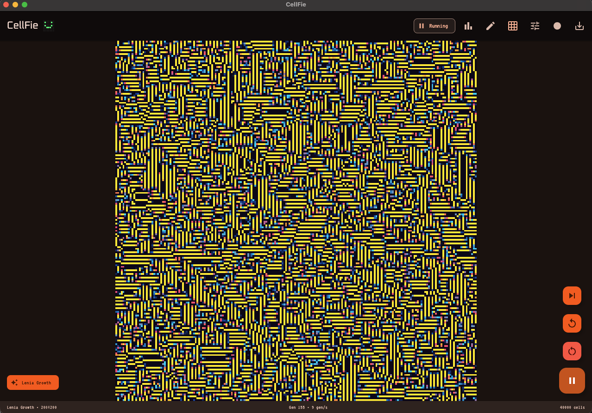
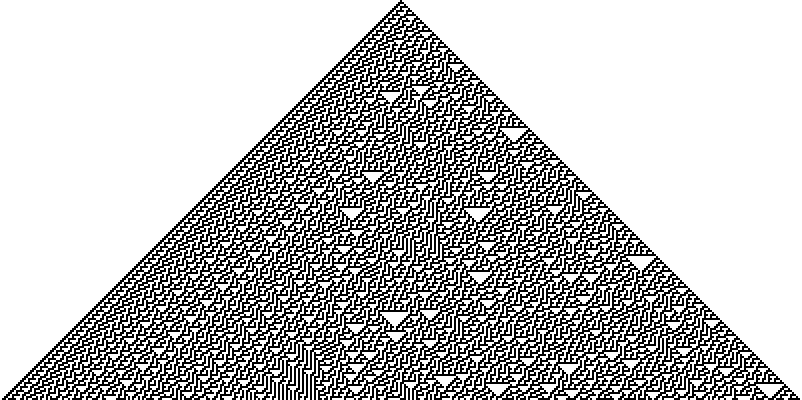
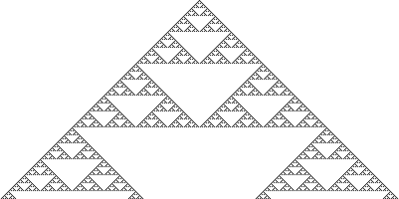
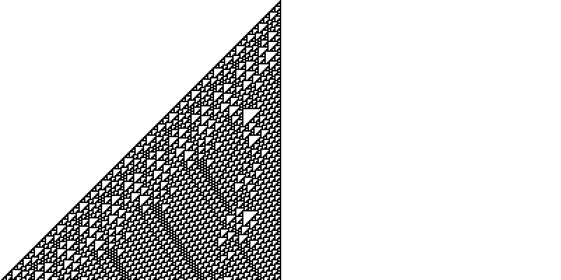
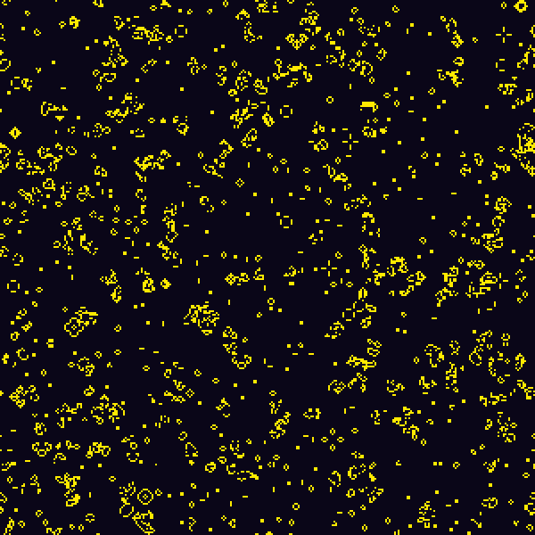
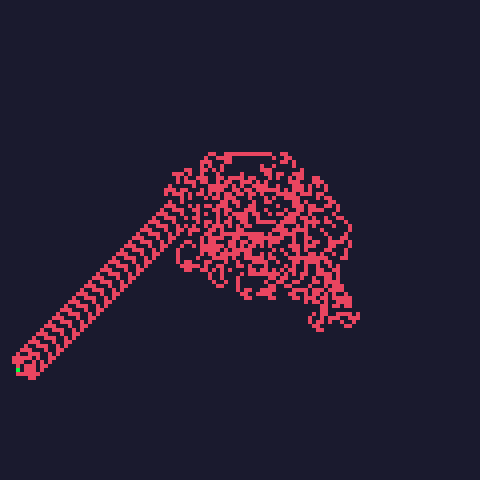
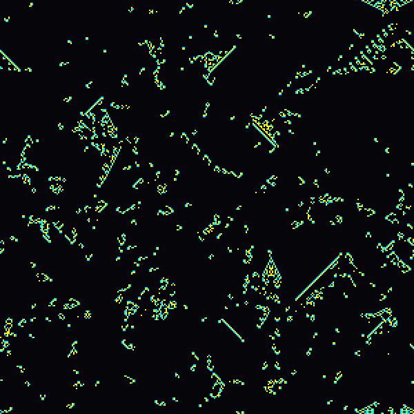
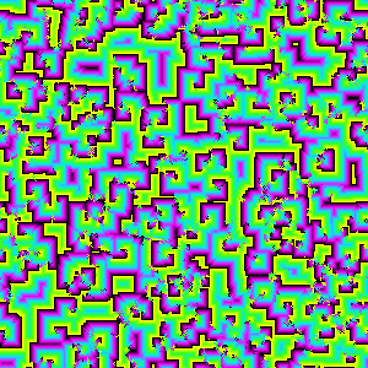

<p align="center">
  
  <br>
  
</p>

<h1 align="center">CellFie</h1>

<p align="center">
A Kotlin Multiplatform cellular automaton explorer for Android, iOS, and Desktop.<br>
Over 300 rules across 14 categories — from Wolfram elementary automata to Turing machines.
</p>

---

## Screenshots

<p align="center">
  &nbsp;&nbsp;
  &nbsp;&nbsp;
  
</p>

<p align="center">
  &nbsp;&nbsp;
  &nbsp;&nbsp;
  
</p>

<p align="center">
  &nbsp;&nbsp;
  
</p>

---

## What Is a Cellular Automaton?

A **cellular automaton** (CA) is a grid of cells, each in one of a finite number of states. At each time step, every cell simultaneously updates its state based on a simple rule that considers the cell and its neighbors. Despite the simplicity of the rules, CAs can produce extraordinarily complex behavior — chaos, self-organization, computation, and even life-like dynamics.

CellFie lets you explore hundreds of these rules interactively. Tap play, watch patterns emerge, tweak parameters, and discover why cellular automata have fascinated mathematicians, physicists, and computer scientists for decades.

---

## Wolfram Elementary Rules (1D)

The simplest possible cellular automata — and among the most profound. Stephen Wolfram systematically studied all 256 of these rules in the 1980s, laying the groundwork for *A New Kind of Science*.

### How They Work

An **elementary cellular automaton** is a one-dimensional line of cells, each either **0** (off) or **1** (on). Each cell's next state depends on three cells: itself and its two immediate neighbors.

Three binary cells produce **8 possible neighborhood patterns**:

| Pattern | `111` | `110` | `101` | `100` | `011` | `010` | `001` | `000` |
|---------|:-----:|:-----:|:-----:|:-----:|:-----:|:-----:|:-----:|:-----:|
| Index   |   7   |   6   |   5   |   4   |   3   |   2   |   1   |   0   |

A rule assigns an output (0 or 1) to each of these 8 patterns. Since each output is one bit and there are 8 patterns, there are 2⁸ = **256** possible rules.

### The Rule Number

The **rule number** (0–255) is simply the 8-bit binary encoding of those outputs. To decode a rule number into its lookup table:

```
For each index i from 0 to 7:
    output[i] = (ruleNumber >> i) & 1
```

**Example — Rule 30:**

```
30 in binary = 00011110

Index:   7  6  5  4  3  2  1  0
Output:  0  0  0  1  1  1  1  0

Pattern → Output:
  111 → 0    110 → 0    101 → 0    100 → 1
  011 → 1    010 → 1    001 → 1    000 → 0
```

Starting from a single black cell on a white background, each generation is drawn as a new row below, building up a 2D image over time.

### Famous Elementary Rules

| Rule | Behavior | Why It Matters |
|------|----------|----------------|
| **Rule 30** | Chaotic, aperiodic | Used by Mathematica for pseudorandom number generation. Wolfram's favorite. |
| **Rule 90** | Sierpinski triangle | Equivalent to XOR of left and right neighbors. Produces a perfect fractal. |
| **Rule 110** | Complex, Class IV | Proven **Turing-complete** by Matthew Cook in 2004 — the simplest known universal computer. |
| **Rule 184** | Particle flow | Models one-lane traffic flow. Particles move right unless blocked. |

<p align="center">
  &nbsp;&nbsp;
  &nbsp;&nbsp;
  
</p>
<p align="center"><em>Left to right: Rule 30 (chaotic), Rule 90 (Sierpinski triangle), Rule 110 (Turing-complete)</em></p>

### Wolfram's Four Classes

Wolfram classified all 256 rules into four behavioral classes:

1. **Class I** — All cells quickly reach a uniform state (e.g., Rule 0, Rule 255)
2. **Class II** — Evolves into stable or periodic structures (e.g., Rule 4, Rule 108)
3. **Class III** — Chaotic, seemingly random behavior (e.g., Rule 30, Rule 45)
4. **Class IV** — Complex structures, localized propagation, long transients (e.g., Rule 110, Rule 54)

Class IV sits at the "edge of chaos" between order and randomness — exactly where computation can happen.

---

## Conway's Game of Life and Life-like Rules

### Conway's Game of Life (B3/S23)

The most famous cellular automaton, invented by John Conway in 1970. It operates on a 2D grid with two states (alive/dead) and the **Moore neighborhood** (8 surrounding cells):

- **Birth:** A dead cell with exactly **3** live neighbors becomes alive
- **Survival:** A live cell with **2 or 3** live neighbors stays alive
- **Death:** All other live cells die (underpopulation or overpopulation)

These three devastatingly simple rules produce:

- **Still lifes** — Stable patterns (block, beehive, loaf)
- **Oscillators** — Patterns that cycle (blinker, toad, pulsar)
- **Spaceships** — Patterns that translate across the grid (glider, LWSS)
- **Guns** — Patterns that emit spaceships indefinitely (Gosper glider gun)

Life was proven **Turing-complete** — you can build a working computer inside it.

<p align="center">
  
</p>
<p align="center"><em>Game of Life after 200 generations — still lifes, oscillators, and glider debris</em></p>

### B/S Notation

Life-like rules are described with **B/S notation**: `B{birth counts}/S{survival counts}`.

Life is **B3/S23** — birth on 3 neighbors, survive on 2 or 3.

| Rule | Name | Description |
|------|------|-------------|
| B3/S23 | **Life** | The classic |
| B36/S23 | **HighLife** | Life + birth on 6. Supports a small self-replicator. |
| B2/S | **Seeds** | Birth on 2, no survival. Every cell dies, creating explosive expanding patterns. |
| B3/S012345678 | **Maze** | Cells never die, growth fills corridors into labyrinthine structures |
| B3/S234567 | **Day & Night** | Symmetric — dead and alive cells obey the same logic (complement-invariant) |
| B35678/S5678 | **Diamoeba** | Grows coral-like amoeboid blobs |
| B345/S5 | **Long Life** | Produces isolated stable islands and long-lived transients |
| B3678/S235678 | **Stains** | Expanding ink-stain blobs that merge together |
| B1357/S1357 | **Replicator** | Every pattern eventually produces copies of itself |
| B4678/S35678 | **Anneal** | "Twisted majority vote" — regions stabilize into large domains |

### Life on Other Lattices

CellFie also includes variants of Life on non-square grids:

- **HexLife** — Game of Life on a hexagonal lattice (6 neighbors)
- **TriLife** — Game of Life on a triangular lattice (3 or 12 neighbors)

---

## Rule Categories

### Totalistic Rules

**Totalistic rules** depend only on the *sum* of cell values in the neighborhood, not on their individual positions. This makes them rotationally symmetric.

**Outer totalistic** rules separate the center cell from its neighbors — the output depends on `(center_value, neighbor_sum)`. A single rule number encodes the entire lookup table.

| Rule | Name | What You See |
|------|------|--------------|
| Rule 846 | **Snowflake** | Dendritic crystal growth from a single seed |
| Rule 68 | **Snowflake Dust** | Scattered sparkling dust particles |
| Rule 750 | **Snowflake Maze** | Maze-like crystalline corridors |
| Rule 301 | **Electric Loops** | Pulsing closed-loop circuits |
| Rule 429 | **Super Loops** | Persistent self-sustaining loops |

### Continuous Rules

Instead of discrete 0/1 states, cells hold **real numbers** (floating-point values). Rules typically average neighbors and apply a function:

```
next = f(average_of_neighbors)
```

| Rule | Description |
|------|-------------|
| **Continuous CA (Default)** | `next = 1.0 × avg + 0.1` — chaotic swirling |
| **Continuous CA (Class IV)** | `next = 1.0 × avg + 0.408` — edge-of-chaos structures |
| **Continuous CA (Chaotic)** | `next = -1.5 × avg + 0.76` — highly turbulent |
| **Real Spirals** | Cyclic growth produces rotating spiral waves |
| **Diffusion** | Heat equation: `next = current + rate × (avg - current)` |
| **Water Skimmers** | Averaging with random perturbation — water-surface ripples |
| **Thunderstorm** | Averaging with sinusoidal time-varying disturbance |

### Neural

Neural-network-inspired cellular automata, where cells behave like artificial neurons:

- **Neural Net** — Each cell computes a sigmoid activation function: `σ(gain × (weighted_sum - threshold))`. With 8 states, this produces oscillating wave-like patterns reminiscent of brain activity.

- **NeuralNet CA (Lenia)** — Inspired by Bert Chan's [Lenia](https://arxiv.org/abs/1812.05433), this uses a continuous growth function with a bell curve kernel. Produces remarkably organic, self-organizing lifeforms — blobs that move, pulsate, and interact like actual organisms.

### Social

Models of collective behavior, opinion dynamics, and social influence:

| Rule | Description |
|------|-------------|
| **Majority Vote** | Each cell adopts the most common state among its neighbors. Models consensus formation. Configurable from 2 to 256 opinion states. |
| **Majority Wins** | Like Majority Vote but excludes the cell's own state — pure peer pressure |
| **Minority Wins** | Cell adopts the *least* common neighbor state — contrarian dynamics |
| **Majority Probably Wins** | Probabilistic voting proportional to neighbor frequency — models imperfect information |
| **Obesity Model** | Social influence model with 4 states (underweight → normal → overweight → obese). Uses Boltzmann-weighted transitions based on neighborhood composition. |
| **Cellular Market Model** | Commodity trader herding model with temperature and noise parameters — models financial market bubbles and crashes |

### Physics

Simulations inspired by physical systems:

| Rule | Description |
|------|-------------|
| **Wireworld** | 4-state circuit simulator: empty → electron head → electron tail → conductor. You can build logic gates, wires, clocks, and even entire CPUs. |
| **Ising Model** | Statistical mechanics of magnetic spins. Cells flip based on energy minimization with thermal noise. Shows phase transitions at the critical temperature T_c ≈ 2.27. |
| **Q2R Ising Model** | Deterministic, energy-conserving variant of Ising. Uses checkerboard alternation — cells only flip when the total local spin is exactly zero. |
| **Diffusion-Limited Aggregation** | Random walkers stick to a growing cluster, producing beautiful fractal dendrites — like frost forming on a window. |
| **Forest Fire** | 8-state ecological model: bare ground → seedling → sapling → tree → burning → smoldering → ashes → bare ground. Trees grow probabilistically; lightning strikes rarely; fire spreads to neighbors. |

### Probabilistic

Rules that incorporate randomness:

| Rule | Description |
|------|-------------|
| **Random Update** | Pure noise — each cell picks a random state every step |
| **Copy Random Neighbor** | Each cell copies the state of one randomly chosen neighbor |
| **Forest Fire** | Growth and lightning are probabilistic events |
| **Ising Model** | Metropolis algorithm — thermal fluctuations drive random spin flips |

### Fractal

Complex-number iterations visualized on the grid:

| Rule | Description |
|------|-------------|
| **Fractal (Mandelbrot)** | Classic z² + c iteration. Each cell maps to a point on the complex plane. |
| **Julia (Chinese Dragon)** | Julia set at c = −0.835 − 0.2321i with sinusoidal phase cycling — creates a tornado animation |
| **Moving Fractal** | Mandelbrot set with a slowly drifting center point |
| **Fractal Iteration / Threshold** | Iteration-count and escape-threshold visualizations |

---

## Turing Machines

CellFie includes a **Turing machine** simulator that runs on the cellular automaton grid. The tape head is a special cell state that moves across the lattice, reading and writing symbols according to a finite state transition table.

### Available Programs

| Program | Description |
|---------|-------------|
| **Busy Beaver** | The most famous Turing machine problem: find the machine with N states that writes the most 1s before halting. Selectable from 1-state (trivial) to 5-state (47 million steps). |
| **Binary Counter** | Perpetually increments a binary number — never halts |
| **Counting** | Traverses and marks the tape in a counting pattern |
| **Subtraction** | Performs unary subtraction, then halts |
| **Bouncing Line** | Moves back and forth leaving a trail |
| **Staircase** | Walks diagonally, building a staircase |
| **Expanding Square** | Spirals outward in a growing square |
| **Zigzag** | Alternates directions in a zigzag trail |
| **Spiral** | Turns on encountering marks, creating an outward spiral |

### Busy Beaver Champions

The [Busy Beaver function](https://en.wikipedia.org/wiki/Busy_beaver) BB(n) asks: what is the maximum number of 1s that an n-state Turing machine can write before halting?

| States | Marks Written | Steps to Halt | Notes |
|:------:|:------------:|:-------------:|-------|
| 1 | 1 | 1 | Trivial |
| 2 | 4 | 6 | |
| 3 | 6 | 21 | |
| 4 | 13 | 107 | Brady, 1983 |
| 5 | 4,098 | 47,176,870 | Marxen & Buntrock — impractical to run to completion in real time |

BB(6) and beyond are unknown and believed to be incomprehensibly large.

---

## Deep Dives: Notable Rules

### Langton's Ant

A deceptively simple 2D Turing machine:

1. **On a white cell:** turn 90° right, flip the cell to black, move forward
2. **On a black cell:** turn 90° left, flip the cell to white, move forward

For the first ~10,000 steps, the ant creates a chaotic, seemingly random blob. Then, suddenly and without warning, it begins constructing a diagonal **"highway"** — an infinitely repeating pattern that extends forever. This emergent order from chaos has never been fully explained mathematically.

Langton's Ant is **Turing-complete**.

<p align="center">
  
</p>
<p align="center"><em>Langton's Ant after 12,000 steps — chaotic blob gives way to the emergent highway</em></p>

### Brian's Brain

A three-state excitable medium:

- **Off (0)** → becomes **On** if exactly 2 neighbors are On
- **On (1)** → becomes **Dying**
- **Dying (2)** → becomes **Off**

This creates self-sustaining waves, filaments, and traveling "sparks" that collide and interact. It models excitable media like heart tissue or neural networks.

<p align="center">
  
</p>
<p align="center"><em>Brian's Brain — chaotic sparks and traveling wave fronts</em></p>

### Cyclic CA

Cells cycle through N states (default 14). A cell advances to the next state only if at least one neighbor is already in that successor state. This creates mesmerizing **spiral waves** that form spontaneously from random initial conditions — resembling chemical reaction-diffusion patterns (like the Belousov–Zhabotinsky reaction).

<p align="center">
  
</p>
<p align="center"><em>Cyclic CA — spiral wave fronts cascade through 14 states</em></p>

### Langton's Lambda (λ)

Rather than a single rule, this is a **meta-parameter** that generates random rule tables. Lambda (λ) controls the fraction of neighborhood configurations that produce a non-zero output:

- **λ ≈ 0** → nearly all cells die (Class I)
- **λ ≈ 0.5** → edge of chaos (Class IV) — complex structures emerge
- **λ ≈ 1** → chaotic noise (Class III)

This demonstrates Langton's hypothesis that computation and complexity emerge at the phase transition between order and chaos.

### Diffusion-Limited Aggregation (DLA)

Random particles wander the grid. When a particle touches the growing crystal cluster, it sticks permanently. The result is a **fractal dendrite** — a branching tree structure with a fractal dimension of about 1.71. DLA models real-world phenomena like:

- Electrodeposition (copper crystals growing in solution)
- Frost patterns on glass
- Lightning bolt branching
- Mineral dendrites in rock

---

## Getting Started

### Build & Run

```bash
# Desktop (JVM)
./gradlew :desktopApp:run

# Android
./gradlew :androidApp:installDebug

# Run tests
./gradlew :shared:desktopTest
```

### Quick Start

1. **Pick a rule** — Tap the rule name in the header to open the rule picker
2. **Choose a category** — Filter by Elementary, Life-like, Physics, etc.
3. **Hit play** — Watch the automaton evolve
4. **Tweak parameters** — Many rules have configurable properties (states, thresholds, temperatures)
5. **Try different initial patterns** — Random, center seed, or custom

### Settings That Persist

CellFie remembers your last rule, its configuration, grid size, simulation speed, color scheme, and initial pattern across app restarts.

---

## Credits

CellFie is a Kotlin Multiplatform port of the Java [CAExplorer](https://github.com/CalebKussworthy/CAExplorer) project, with additional rules, Turing machine programs, and a modern Compose Multiplatform UI.

---

<p align="center">
  
</p>
